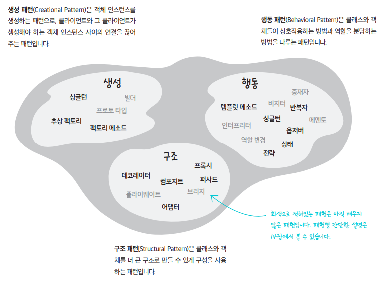

# 디자인 패턴이란?

디자인 패턴은 모듈의 세분화된 역할이나 모듈들 간의 인터페이스 구현 방식을 설계할때 참조할 수 있는 전형적인 해결 방식을 말한다.

디자인 패턴을 통해 설계 문제, 해결 방법, 해결 방법을 언제 적용해야 할지, 그 결과는 무엇인지 등을 알 수 있다.

또한 디자인 패턴은 한 패턴에 변형을 가하거나 어떠한 요구사항을 반영하면 다른 패턴으로 변형되는 특징이 있다.

1995년 GoF(Gang of Four)라고 불리는 Erich Gamma, Richard Helm, Ralph Johnson, John Vissides가 처음으로 디자인 패턴을 구체화하였다.

GoF의 디자인 패턴은 소프트웨어 공학에서 가장 많이 사용되는 디자인 패턴이다.

목적에 따라 분류할 시 생성 패턴 5개, 구조 패턴 7개, 행위 패턴 11개, 총 23개의 패턴으로 구성된다.

# GoF 디자인 패턴

GoF 디자인 패턴을 분류하는 기준은 두 가지이다.

첫째로, 목적에 따라 분류하면 생성, 구조, 행동 3가지로 나눌 수 있다.

각각의 패턴이 어떤 일을 하기 위한 것인지에 관한 것이다.

생성 패턴은 객체의 생성 과정에 관여, 구조 패턴은 객체의 합성에 관여, 행동 패턴은 객체가 상호작용하는 방법이나 관심사를 분리하는 방법에 관여한다.

둘째로 범위에 따라 분류할 수도 있다. 패턴을 주로 클래스에 적용하는지, 객체에 적용하는 지 구분하는 것이다.

클래스 패턴은 클래스와 서브클래스 간의 관련성을 다룬다. 주로 상속을 통해 관련되며, 컴파일 타임에 정적으로 결정된다.

객체 패턴은 객체 간의 관련성을 다루고, 런타임에 변경될 수 있는 동적인 성격을 가진다.

> 이미지 출처 : https://m.hanbit.co.kr/channel/category/category_view.html?cms_code=CMS8616098823

## 생성 패턴

생성 패턴은 객체의 생성과 관련된 패턴이다.

객체의 인스턴스 과정을 추상화하는 방법이다.

객체의 생성과 참조 과정을 캡슐화하여 객체가 생성되거나 변경되어도 프로그램 구조에 영향을 받지 않도록 하여 프로그램에 유연성을 더해준다.

생성 클래스 패턴은 객체를 생성하는 일부를 서브클래스가 담당하도록 하며, 생성 객체 패턴은 객체 생성을 다른 객체에게 위임한다.

| 이름                       | 의도                                                   |
|--------------------------|------------------------------------------------------|
| 추상 팩토리(Abstract Factory) | 구체적인 클래스를 지정하지 않고 인터페이스를 통해 서로 연관되는 객체들을 그룹으로 표현함    |
| 빌더(Builder)              | 복합 객체의 생성과 표현을 분리하여 동일한 생성 절차에서도 다른 표현 결과를 만들어낼 수 있음 |
| 팩토리 메소드(Factory Method)  | 객체 생성을 서브클래스로 위임하여 캡슐화함                              |
| 프로토타입(Prototype)         | 원본 객체를 복사함으로써 객체를 생성함                                |
| 싱글톤(Singleton)           | 어떤 클래스의 인스턴스는 하나임을 보장하고 어디서든 참조할 수 있도록 함             |

## 구조 패턴
구조 패턴은 클래스나 객체들을 조합해 더 큰 구조로 만들 수 있게 해주는 패턴이다.

구조 클래스 패턴은 상속을 통해 클래스나 인터페이스를 합성하고, 구조 객체 패턴은 객체를 합성하는 방법을 정의한다.

| 이름                | 	의도                                                      |
|-------------------|----------------------------------------------------------|
| 어댑터(Adapter)      | 	클래스의 인터페이스를 다른 인터페이스로 변환하여 다른 클래스가 이용할 수 있도록 함          |
| 브리지(Bridge)       | 	구현부에서 추상층을 분리하여 각자 독립적으로 확장할 수 있게 함                     |
| 컴포지트(Composite)   | 	객체들의 관계를 트리 구조로 구성하여 복합 객체와 단일 객체를 구분없이 다룸              |
| 데코레이터(Decorator)  | 	주어진 상황 및 용도에 따라 어떤 객체에 다른 객체를 덧붙이는 방식                   |
| 퍼싸드(Facade)       | 	서브시스템에 있는 인터페이스 집합에 대해 하나의 통합된 인터페이스(Wrapper) 제공        |
| 플라이웨이트(Flyweight) | 	크기가 작은 여러 개의 객체를 매번 생성하지 않고 가능한 한 공유할 수 있도록 하여 메모리를 절약함 |
| 프록시(Proxy)        | 	접근이 어려운 객체로의 접근을 제어하기 위해 객체의 Surrogate나 Placeholder를 제공 |

## 행위 패턴
행위 패턴은 클래스나 객체들이 서로 상호작용하는 방법이나 어떤 태스크, 어떤 알고리즘을 어떤 객체에 할당하는 것이 좋을지를 정의하는 패턴이다. 
 
즉, 객체나 클래스의 교류 방법에 대해 정의하는 것이다. 

행위 패턴은 하나의 객체로 수행할 수 없는 작업을 여러 객체로 분배하면서 그들 간의 결합도를 최소화 할 수 있도록 도와준다. 
 
행위 클래스 패턴은 상속을 통해 알고리즘과 제어 흐름을 기술하고, 행위 객체 해턴은 하나의 작업을 수행하기 위해 객체 집합이 어떻게 협력하는지를 기술한다.

| 이름                             | 의도                                                            |
|--------------------------------|---------------------------------------------------------------|
| 책임 연쇄(Chain of Responsibility) | 	요청을 받는 객체를 연쇄적으로 묶어 요청을 처리하는 객체를 만날 때까지 객체 Chain을 따라 요청을 전달함 |
| 커맨드(Command)	                  | 요청을 객체의 형태로 캡슐화하여 재사용하거나 취소할 수 있도록 저장함                        |
| 인터프리터(Interpreter)	            | 특정 언어의 문법 표현을 정의함                                             |
| 반복자(Iterator)                  | 	내부를 노출하지 않고 접근이 잦은 어떤 객체의 원소를 순차적으로 접근할 수 있는 동일한 인터페이스 제공    |
| 중재자(Mediator)	                 | 한 집합에 속해있는 객체들의 상호작용을 캡슐화하여 새로운 객체로 정의                        |
| 메멘토(Memento)	                  | 객체가 특정 상태로 다시 되돌아올 수 있도록 내부 상태를 실체화                           |
| 옵서버(Observer)                  | 	객체 상태가 변할 때 관련 객체들이 그 변화를 통지받고 자동으로 갱신될 수 있게 함               |
| 상태(State)	                     | 객체의 상태에 따라 동일한 동작을 다르게 처리해야할 때 사용                             |
| 전략(Strategy)	                  | 동일 계열의 알고리즘군을 정의하고 캡슐화하여 상호교환이 가능하도록 함                        |
| 템플릿 메소드(Template Method)       | 	상위클래스는 알고리즘의 골격만을 작성하고 구체적인 처리는 서브클래스로 위임함                   |
| 방문자(Visitor)                   | 	객체의 원소에 대해 수행할 연산을 분리하여 별도의 클래스로 구성함                         |
