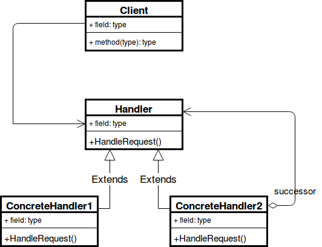

# 책임 연쇄 패턴이란?
클라이언트로부터 요청을 처리할 수 있는 처리 객체를 집합으로 만들어 부여함으로 결합을 느슨하게 하기 위해 만들어진 디자인 패턴.

책임 연쇄 패턴(Chain Of Responsibility Pattern, COR)은 클라이어트의 요청에 대한 세세한 처리를 하나의 객체가 몽땅 하는 것이 아닌, 여러개의 처리 객체들로 나누고, 

이들을 사슬(chain) 처럼 연결해 집합 안에서 연쇄적으로 처리하는 행동 패턴이다.

이러한 처리 객체들을 핸들러(handler)라고 부르는데, 요청을 받으면 각 핸들러는 요청을 처리할 수 있는지, 

없으면 체인의 다음 핸들러로 처리에 대한 책임을 전가한다. 

한마디로 책임 연쇄라는 말은 요청에 대한 책임을 다른 객체에 떠넘긴다는 소리이다. 

떠넘긴다고 하니까 부정적인 의미로 들릴수도 있겠지만, 이러한 체인 구성은 하나의 객체에 처리에 대한 책임을 요청을 보내는 쪽(sender)과 요청을 처리하는(receiver) 쪽을 분리하여 

각 객체를 부품으로 독립시키고 결합도를 느슨하게 만들며, 상황에 따라서 요청을 처리할 객체가 변하는 프로그램에도 유연하게 대응할 수 있다는 장점을 가지고 있다. 

특히나 중첩 if-else문들을 최적화하는데 있어 실무에서도 많이 애용되는 패턴중 하나이기도 하다.

# 장점
- 결합도를 낮추며, 요청의 발신자와 수신자를 분리시킬 수 있다.
- 클라이언트는 처리 객체의 집합 내부의 구조를 알 필요가 없다.
- 집합 내의 처리 순서를 변경하거나 처리 객체를 추가 또는 삭제할 수 있어 유연성이 향상된다.
- 새로운 요청에 대한 처리 객체 생성이 편리해진다.
# 단점
- 충분한 디버깅을 거치지 않을 경우 집합 내부에서 사이클이 발생할 수 있다.
- 디버깅 및 테스트가 쉽지 않다.
- 요청이 반드시 수행된다는 보장이 없다.
- 책임 연쇄로 인한 처리 지연 문제가 발생할 여지가 있다.

> 출처: https://inpa.tistory.com/entry/GOF-💠-Chain-Of-Responsibility-패턴-완벽-마스터하기