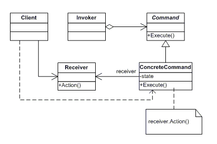

# 커맨드 패턴이란?
- 실행될 기능을 캡슐화함으로써 주어진 여러 기능을 실행할 수 있는 재사용성이 높은 클래스를 설계하는 패턴
  - 즉, 이벤트가 발생했을 때 실행될 기능이 다양하면서도 변경이 필요한 경우 이벤트를 발생시키는 클래스를 변경하지 않고 재사용하고자 할 때 유용하다.
- 기능의 실행을 요구하는 호출자 클래스와 실제 기능을 실행하는 수신자 클래스 사이의 의존성을 제거한다.
- 따라서 실행 될 기능의 변경에도 호출자 클래스를 수정 없이 그대로 사용할 수 있다.

# 장점
- 요청 발신자와 수신자 사이의 결합도를 낮춘다.
- 요청을 쉽게 추가하거나 수정할 수 있다.
- 요청을 저장하거나, 로그를 남기는 등의 작업을 쉽게 할 수 있다.
- 실행 취소와 재실행 같은 기능을 제공하기 수월하다.
# 단점
- 각각 개별 요청에 대해 Command 클래스를 만들어야하기 때문에, 클래스가 많아질 수 있다.
- 고수준의 코드 복잡성이 증가할 수 있다.