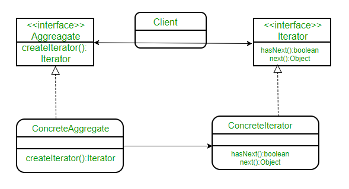

# 반복자 패턴이란?
- 컬렉션 구현 방법을 노출시키지 않으면서도 그 집합체안에 들어있는 모든 항목에 접근할 수 있게 해 주는 방법을 제공해 주는 패턴
- 이터레이터 패턴을 사용하면 집합체 내에서 어떤 식으로 일이 처리되는지 몰라도 그 안에 들어있는 항목들에 대해서 반복작업을 수행 할 수 있다

- Iterator
  - 집합체의 요소들을 순서대로 검색하기 위한 인터페이스 정의
- ConcreteIterator
  - Iterator 인터페이스를 구현함
- Aggregate
  - 여러 요소들로 이루어져 있는 집합체
- ConcreteAggregate
  - Aggregate 인터페이스를 구현하는 클래스

# 장점
- 집합체 클래스의 응집도를 높여준다.
- 집합체 내에서 어떤 식으로 일이 처리되는지 알 필요 없이, 집합체 안에 들어있는 모든 항목에 접근 할 수 있게 해준다.
- 모든 항목에 일일이 접근하는 작업을 컬렉션 객체가 아닌 이터레이터 객체에서 맡게 된다. 이렇게 하면, 집합체의 인터페이스 및 구현이 간단해질 뿐만 아니라, 집합체에서는 반복 작업에서 손을 떼고 원래 자신이 할 일에만 전념할 수 있다.
# 단점
- 단순 순회를 구현하는 경우 클래스만 많아져 복잡도가 증가할 수 있다.

# Ref
- https://velog.io/@cham/Design-Pattern-%EC%9D%B4%ED%84%B0%EB%A0%88%EC%9D%B4%ED%84%B0-%ED%8C%A8%ED%84%B4-iterator-pattern#%EA%B5%AC%ED%98%84