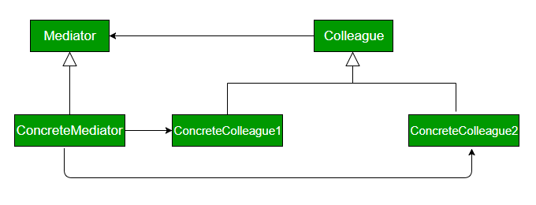

# 중재자 패턴이란?
- 객체 간 상호 작용을 캡슐화하는 디자인 패턴이다.
- 중재자 패턴은 중재자라는 객체 안에서 서로 다른 객체들을 캡슐화하여 객체들이 더 이상 직접적으로 상호 작용하지 않고 중재자를 통해서만 커뮤니케이션 하도록 한다.
- 객체 간 의존성을 줄이며 클래스 간 느슨한 결합을 만들어준다.

- Mediator : Colleague 객체간의 커뮤니케이션을 위한 인터페이스 정의
- Colleague : Mediator를 통해 다른 Colleague와 커뮤니케이션을 위한 인터페이스 정의
- ConcreteMediator : Mediator 구현체로 Colleague들간의 상호 커뮤니케이션을 위해 Colleague들을 가지고 있으며 커뮤니케이션을 조정함
- ConcreteColleague : Colleague 인터페이스 구현체
# 장점
- 효율적 자원 관리
- 객체 간 통신을 위해 서로 직접 참조하지 않아도 된다.

# 단점
- 객체 간 통신 로직이 복잡해지거나 객체의 형태가 자주 변경되는 경우 유지  보수 및 관리가 어렵다.