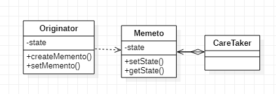

# 메멘토 패턴이란?
객체의 상태 정보를 저장하고 사용자의 필요에 의하여 원하는 시점의 데이터를 복원할 수 있는 패턴.

우리가 흔히 사용하는 그림판, 메모장 등을 통해 작업을 하다 ctrl + z 를 통해 작업 취소를 할 경우가 있는데 이와 같이 이전의 상태에 대한 정보를 일부 저장해야하는 경우 사용하는 패턴이라고 이해하면 쉽다.

# 구조

- Originator
  - Memento 객체를 생성하여 자신의 현재 State를 저장한다.
  - State를 복원할 때 Memento를 사용한다.
- Memento
  - Originator의 State를 스냅샷 형태로 가진다.
  - 외부 객체가 Originator에 접근하는 것을 막는다.
  - Memento를 immutable하게 만들고, 생성자 주입을 통해 Originator의 데이터를 한 번만 전달받는다.
- CareTaker
  - Memento 객체를 저장하여 Originator의 State History를 가진다.
  - Memento의 내용을 조작하지 않는다.

# 장점
- 저장된 상태를 핵심 객체와는 다른 별도의 객체에 보관하기에 안전하다.
- 핵심 객체의 데이터를 계속해서 캡슐화된 상태로 유지할 수 있다.
- 복구 기능을 구현하기 쉽다.
# 단점
- 이전 상태의 객체를 저장하기 위한 Originator가 클 경우, 많은 메모리가 필요하다.
- 상태를 저장하고 복구하는데 시간이 오래 걸릴 수 있다.
  - 자바 시스템에서는 시스템의 상태를 저장할 때, 직렬화를 사용하는 것이 좋다.
