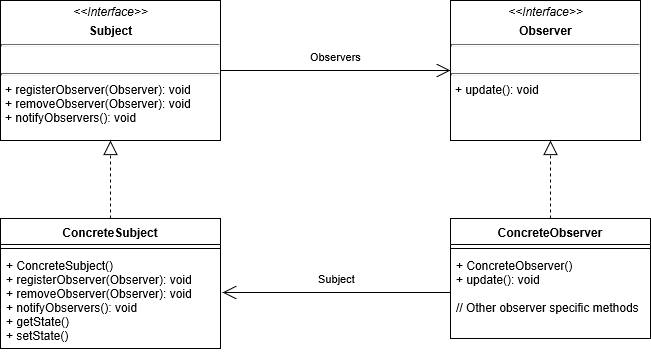

# 옵저버 패턴이란?
옵저버들이 관찰하고 있는 대상자의 상태의 변화가 있을 때 마다 대상자는 직접 목록의 각 관찰자들에게 통지하고, 관찰자들은 알림을 받아 조치를 취하는 행동 패턴이다.

옵저버 패턴은 일대다 의존성을 가지며, 주로 분산 이벤트 핸들링 시스템을 구현하는데 사용된다.
(Pub/Sub 모델로도 알려져 있다.)

흔히 뉴스 피드나 유튜브로 비유하면 이해에 용이하다.

유튜브 채널은 발행자가 되고 구독자들은 관찰자가 되는 구조이다.

# 장점
- Subject의 상태 변경을 주기적으로 조회하지 않고 자동으로 감지할 수 있다.
- 발행자의 코드를 변경하지 않고도 새 구독자 클래스를 도입할 수 있어 OCP를 준수한다.
- 런타임 시점에 발행자와 구독자의 관계를 맺을 수 있다.
- 느슨한 결합을 유지한다.
# 단점
- 구독자는 순서를 제어할 수 없고, 무작위로 알림을 받는다.
- 옵저버 패턴을 자주 구성하면 구조와 동작을 알아보기 힘들어 코드 복잡도가 증가한다.
- 다수의 옵저버 객체를 등록 이후 해지하지 않는다면 메모리 누수가 발생할 수 있다.
