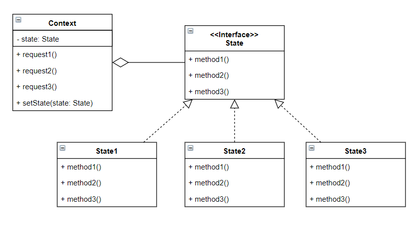

# 상태 패턴이란?
객체가 상태에 따라 행위를 다르게 할 때, 직접 상태를 체크하여 상태에 따른 행위를 호출하는 것이 아닌 상태를 객체화하여 필요에 따라 다르게 행동하도록 위임하는 디자인 패턴.

- state : 상태를 추상화한 고수준 모듈
- ConcreteState : 구체적 상태를 클래스로 표현한 것, State 역할로 결정되는 API를 구체적으로 구현한다.
- Context : State를 이용하는 시스템, 시스템 상태를 나타내는 State 객체를 합성하여 가지고 있다. 요청을 받으면 State 객체에 행위 실행을 위임한다.

# 사용 시기
- 객체의 행동(메서드)가 상태(state)에 따라 각기 다른 동작을 할때. 
- 상태 및 전환에 걸쳐 대규모 조건 분기 코드와 중복 코드가 많을 경우
- 조건문의 각 분기를 별도의 클래스에 넣는것이 상태 패턴의 핵심
- 런타임에서 객체의 상태를 유동적으로 변경해야 할때

# 장점
- 상태에 따른 동작을 개별 클래스로 옮겨 관리할 수 있다.
- 상태와 관련된 모든 동작을 각각의 상태 클래스에 분산 시킴으로써, 코드 복잡도를 줄일 수 있다.
- SRP 준수
- OCP 준수
- 하나의 상태 객체만 사용하여 상태 변경을 하므로 일관성 없는 상태 주입을 방지하는데 도움이 된다.

# 단점
- 상태 별로 클래스를 생성하므로, 관리할 클래스가 늘어난다.
- 상태 클래스의 개수가 많고 규칙이 자주 변경되면, Context의 상태 코드가 복잡해진다.
- 객체의 적용할 상태가 몇 가지 없거나, 변경이 거의 이루어지지 않는 경우 오버 엔지니어링이 된다.

#Ref
- https://inpa.tistory.com/entry/GOF-%F0%9F%92%A0-%EC%83%81%ED%83%9CState-%ED%8C%A8%ED%84%B4-%EC%A0%9C%EB%8C%80%EB%A1%9C-%EB%B0%B0%EC%9B%8C%EB%B3%B4%EC%9E%90#%EC%83%81%ED%83%9C_%ED%8C%A8%ED%84%B4_%EC%9E%A5%EC%A0%90