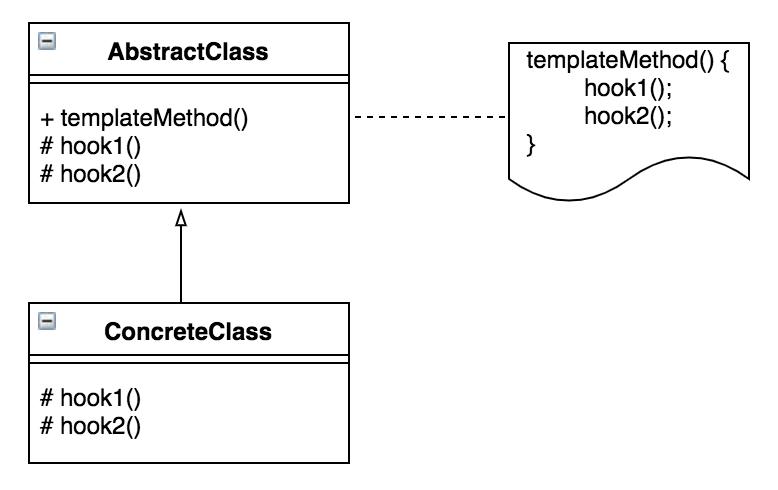

# 템플릿 메소드 패턴이란?
어떤 작업을 처리하는 일부분을 서브 클래스로 캡슐화하여 전체 일을 수행하는 구조는 바꾸지 않으면서 특정 단계에서 수행하는 내역을 바꾸는 패턴.

전체적으로는 동일하며, 부분적으로는 다른 구문으로 구성된 메소드의 코드 중복을 최소화할 때 유용하다.

# 장점
- 중복 코드를 줄일 수 있다.
- 자식 클래스의 역할을 줄여 핵심 로직의 관리가 용이하다.
- 서브 클래스의 역할을 줄이고, 핵심 로직을 상위 클래스에서 관리하므로 관리가 용이해진다.
# 단점
- 추상 메소드가 많아지면서 클래스 관리가 복잡해진다.
- 제공된 골격에 의해 유연성이 제한될 수 있다.
- 상위 클래스의 수정이 발생할 경우, 서브 클래스의 수정이 필요할 수도 있다.