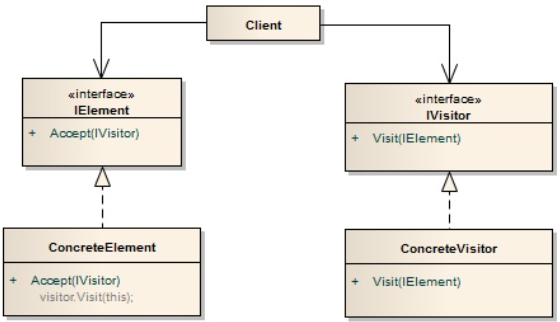

# 방문자 패턴이란?
데이터 구조와 데이터 처리를 분리해주는 패턴이다.

방문자와 방문 공간을 분리하여, 방문 공간이 방문자를 맞이할 때, 이후에 대한 행동을 방문자에게 위임한다.

즉, 로직과 구조를 분리하는 패턴으로, 로직과 구조가 분리되며 구조를 수정하지 않고도 새로운 동작을 기존 객체 구조에 추가할 수 있다.

# 장점
- 작업 대상과 항목을 분리시킨다.
- 데이터와 알고리즘이 분리되어 데이터의 독립성을 높인다.
- 작업 대상의 입장에서는 인터페이스를 통일시켜, 사용자에게 동일한 인터페이스를 제공한다.
# 단점
- 새로운 작업 대상이 추가될 때마다 작업 주체도 이에 대한 로직을 추가해야 한다.
- 두 객체 간 결합도가 높아진다.
