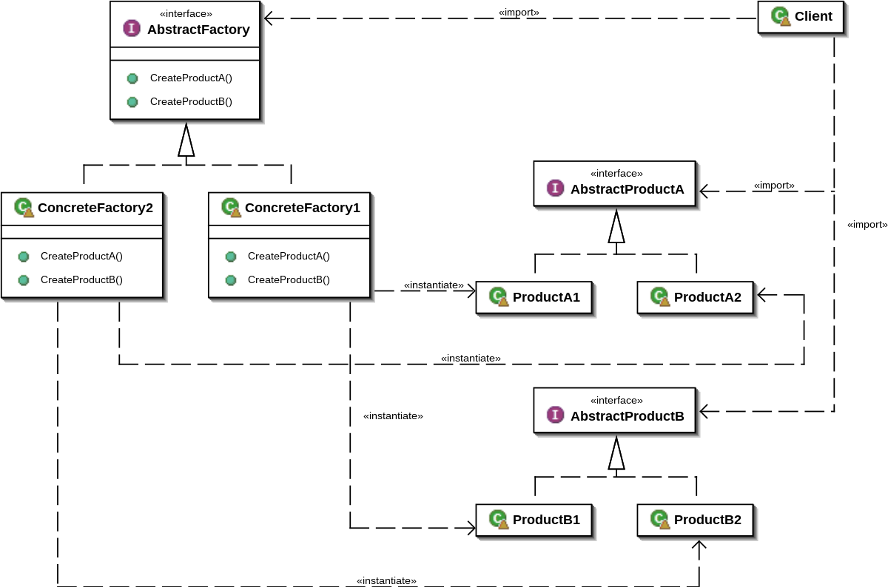

# Abstract Factory Pattern
추상 팩토리 패턴은 객체 생성을 담당하는 인터페이스를 제공하는 패턴이다.

관련된 객체의 집합을 생성하거나 구성하며, 이러한 객체들이 서로 호환되도록 하는 것을 주 목적으로 한다.

주로 객체 생성에 대한 구체적인 클래스를 지정하지 않고, 관련된 객체들을 생성하고 조합할 수 있도록 하는 추상적인 인터페이스를 제공한다.
# 구성 요소

> 이미지 출처 : https://en.wikipedia.org/wiki/Abstract_factory_pattern
### 1. AbstractFactory
객체 생성을 위한 인터페이스를 정의한다.
### 2. ConcreteFactory
AbstractFactory를 구현하며, 실제로 객체를 생성한다.
### 3.AbstractProduct
생성될 객체의 인터페이스를 정의한다.
### 4.ConcreteProduct
AbstractProduct를 구현하며, 실제로 생성될 객체이다.
### 5.Client
팩토리 및 제품과 상호 작용하는 코드를 포함한다.

# 적용 사례
## JDK
Java API에서는 javax.xml.parsers.DocumentBuilderFactory와 
javax.xml.transform.TransformerFactory 등이 추상 팩토리 패턴을 사용한 예시이다.
클라이언트는 구체적인 구현체를 몰라도 추상적인 인터페이스를 통해 객체를 생성할 수 있다.
```
DocumentBuilderFactory factory = DocumentBuilderFactory.newInstance();
TransformerFactory transformerFactory = TransformerFactory.newInstance();
```
## Spring
Spring 프레임워크에서는 IoC 컨테이너가 객체를 생성하고 관리할 때 추상 팩토리 패턴을 활용한다. 

ApplicationContext가 Bean 객체를 생성하고 관리하는데, 클라이언트 코드는 추상적인 인터페이스를 통해 Bean을 요청할 수 있다.
```
// ApplicationContext를 이용한 Bean 생성
ApplicationContext context = new ClassPathXmlApplicationContext("beans.xml");
MyBean myBean = (MyBean) context.getBean("myBean");
```

# Factory Method와의 차이
> 출처: https://inpa.tistory.com/entry/GOF-💠-추상-팩토리Abstract-Factory-패턴-제대로-배워보자 [Inpa Dev 👨‍💻:티스토리]
## Factory Method
둘다 팩토리 객체를 통해 구체적인 타입을 감추고 객체 생성에 관여하는 패턴 임에는 동일하다. 

또한 공장 클래스가 제품 클래스를 각각 나뉘어 느슨한 결합 구조를 구성하는 모습 역시 둘이 유사하다.
그러나 주의할 것은 추상 팩토리 패턴이 팩토리 메서드 패턴의 상위 호환이 아니라는 점이다. 

두 패턴의 차이는 명확하기 때문에 상황에 따라 적절한 선택을 해야 한다.

예를들어 팩토리 메서드 패턴은 객체 생성 이후 해야 할 일의 공통점을 정의하는데 초점을 맞추는 반면, 추상 팩토리 패턴은 생성해야 할 객체 집합 군의 공통점에 초점을 맞춘다.
## 공통점
객체 생성 과정을 추상화한 인터페이스를 제공객체 생성을 캡슐화함으로써 구체적인 타입을 감추고 느슨한 결합 구조를 표방
## 차이점
### 팩토리 메소드 패턴
- 구체적인 객체 생성과정을 하위 또는 구체적인 클래스로 옮기는 것이 목적
- 한 Factory당 한 종류의 객체 생성 지원
- 메소드 레벨에서 포커스를 맞춤으로써, 클라이언트의 ConcreteProduct 인스턴스의 생성 및 구성에 대한 의존을 감소
### 추상 팩토리 패턴
- 관련 있는 여러 객체를 구체적인 클래스에 의존하지 않고 만들 수 있게 해주는 것이 목적
- 한 Factory에서 서로 연관된 여러 종류의 객체 생성을 지원. (제품군 생성 지원)
- 클래스(Factory) 레벨에서 포커스를 맞춤으로써, 클라이언트의 ConcreteProduct 인스턴스 군의 생성 및 구성에 대한 의존을 감소
