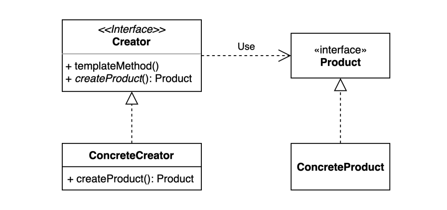
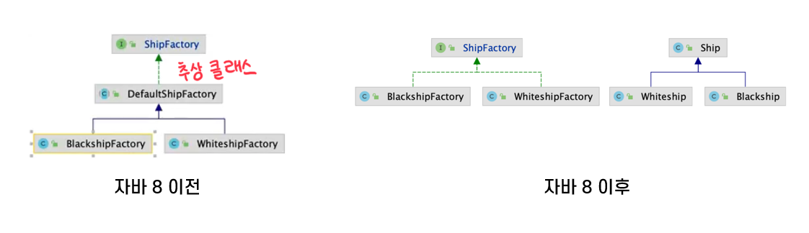

# 팩토리 메소드 패턴
객체의 생성부를 캡슐화하여 결합을 느슨하게 하며, 구체적 타입에 의존하지 않도록 한다.

상속을 통해 서브 클래스에서 팩토리 메소드를 오버라이딩하여 객체의 생성부를 구현한다.

상위 클래스에 알려지지 않은 구체 클래스를 생성하는 패턴이며, 하위 클래스가 어떤 객체를 생성할 지를 결정하도록 하는 패턴이기도 하다.

# 사용 이유
객체를 생성하기 위해 인터페이스를 정의하지만, 어떤 클래스의 인스턴스를 생성할 지에 대해선 서브 클래스에서 이루어지도록 하여 재정의 가능한 것으로 설게하지만, 복잡해지지 않게 한다.
- 생성할 객체 타입을 예측할 수 없을 때
- 생성할 객체를 기술하는 책임을 서브 클래스에게 정의하고자 할 때
- 객체 생성의 책임을 서브클래스에 위임시키고 서브클래스에 대한 정보를 은닉하고자 할 때
# 장 / 단점
## 장점
- 기존 코드를 수정하지 않고 새로운 인스턴스를 다른 방법으로 생성하도록 확장할 수 있다.
  - Product와 Creator 간의 결합이 느슨하다.
    - 확장에 열려있고 변경에 닫혀있는 객체지향 원칙을 적용했기 때문에 가능하다.
- 코드가 간결해진다.
- 병렬적 클래스 계층도를 연결하는 역할을 담당할 수 있다.
> 팩토리 메소드 패턴 적용 팁
> 1. 자바 8의 인터페이스 default 메소드
> - 인터페이스에 추상 메소드가 아닌 default 메소드를 통해 기능을 구현할 수 있게 돼, 상속받는 서브클래스의 중복코드를 제거할 수 있다.
> 2. 자바 9의 인터페이스 private 메소드
> - 기능 구현이 가능해지면서 인터페이스의 내부 로직을 private 메소드로 구현하면 읽기 좋은 코드로 작성할 수 있다.

## 단점
- 클래스가 많아진다.
  - 제품 클래스의 변경마다 새로운 서브 클래스를 생성해야 한다.
- 클라이언트가 creator 클래스를 반드시 상속해 product를 생성해야 한다.
# Ref
- https://dev-youngjun.tistory.com/195
