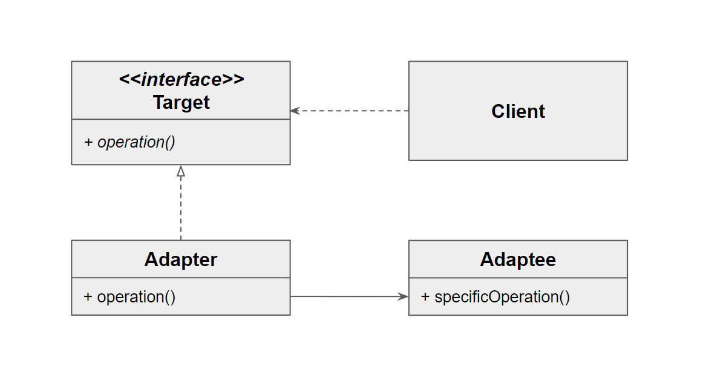

# 어댑터 패턴이란?
호환되지 않는 인터페이스를 가진 객체들이 협업할 수 있도록 해주는 구조적 디자인 패턴.

클라이언트가 사용하는 인터페이스를 따르지 않는 레거시 코드를 재사용할 수 있게 해준다.



- Target 은 변화에 대한 요구사항이다.
- Adaptee 는 기존의 코드이다.
- Adapter 는 변화에 대한 요구사항을 구현한 새로운 코드이다.
- Adaptee 가 가지고 있는 기능을 Adapter 가 주입받아 operation() 을 구현한다. 
- Client 는 인터페이스인 Target 을 통해 이를 사용할 수 있게 된다.

# 어댑터 패턴을 통해 해결할 수 있는 문제
- 외부 라이브러리 클래스를 사용하고 싶은데, 클래스의 인터페이스가 호환되지 않을 때,
- 여러 자식 클래스가 존재할 때, 부모 클래스를 수정하기에 호환성 문제가 발생할 때

# 장점
- 기존 코드를 변경하지 않고 원하는 인터페이스 구현체를 만들어 재사용할 수 있다.
  - OCP에 해당
- 기존 코드가 하던 일과 특정 인터페이스 구현체로 변환하는 작업을 각기 다른 클래스로 분리하여 관리할 수 있다.
  - SRP에 해당
# 단점
- 다수의 새로운 인터페이스와 클래스를 도입해야 하므로 구조가 복잡해진다.
- 때로는 서비스 클래스를 변경하는 것이 간단할 수도 있다.
# 예제
## Collections
``` List<String> strings = Arrays.asList("a", "b", "c");
Enumeration<String> enumeration = Collections.enumeration(strings);
ArrayList<String> list = Collections.list(enumeration);
```
- 클라이언트가 간단한 문자열만 인자로 넘겨도 Collections 클래스를 생성할 수 있도록 도와준다.
- 둘째 줄의 경우, strings 가 Adaptee 의 역할이며, Collections 가 Adapter 에 해당하는 역할이고, Enumeration 이 Target 에 해당하는 역할이다.
## java.io
```
try(InputStream is = new FileInputStream("input.txt");
    InputStreamReader isr = new InputStreamReader(is);
    BufferedReader reader = new BufferedReader(isr)) {
    while(reader.ready()) {
        System.out.println(reader.readLine());
    }
} catch (IOException e) {
    throw new RuntimeException(e);
}
```
- txt 파일을 읽어 (File) InputStream 으로 만든 후 InputStreamReader 로 만들고 BufferedReader 로 만든 후 코드에서 활용하고 있다.
- File -> InputStream -> InputStreamReader -> BufferedReader
## HandlerAdapter
- 우리가 여태까지 봤던 형태와 다르게 인터페이스 형태로 Adapter 를 제공해주고 있다.
- 디자인 패턴은 딱 정해진 것이 아니라 보는 시각에 따라 다른 패턴으로 보일 수 있다.
- HandlerAdapter 인터페이스를 구현하면, DispatcherServlet 필드에 HandlerAdapter 로서 등록되어 이용될 수 있게 해준다.
- 스프링의 요청 처리 동작을 편의성 좋은 객체들을 통해 내 마음대로 확장할 수 있도록 도와준다.

# Ref
https://jake-seo-dev.tistory.com/379