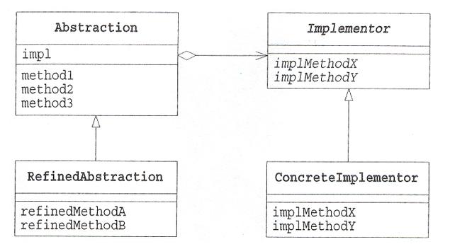

# 브릿지 패턴이란?
구현부에서 추상층을 분리하여 각자 독립적으로 변형이 가능하고 확장이 가능하도록 도와주는 패턴.

즉, 기능과 구현에 대해 두 개를 별도의 클래스로 구현한다.

# 구조

- Abstraction : 기능 계층의 최상위 클래스. 구현 부분에 해당하는 클래스를 인스턴스를 가지고 해당 인스턴스를 통해 구현부분의 메서드를 호출합니다.
- RefinedAbstraction : 기능 계층에서 새로운 부분을 확장한 클래스
- Implementor : Abstraction의 기능을 구현하기 위한 인터페이스 정의
- ConcreteImplementor : 실제 기능을 구현합니다.

# 장점
- 클래스 계층을 분리할 때 완전한 인터페이스를 결합하지 않는다.
- 이를 통해 클래스에서 구현과 추상 부분 2개의 계층으로 분리할 수 있고, 분리된 2개의 추상 계층과 구현 계층은 독립적인 확장이 가능하다.
- 브릿지 패턴을 통해 런타임 시점에 어떤 방식으로 기능을 구현할지 선택할 수 있다.
- 기능을 독립적으로 확장할 수 있다면 상세한 기능을 외부로부터 숨길 수 있는 은닉 효과도 얻을 수 있다.
# 단점
- 추상화를 통해 코드를 분리할 경우 디자인 설계가 복잡해진다.
