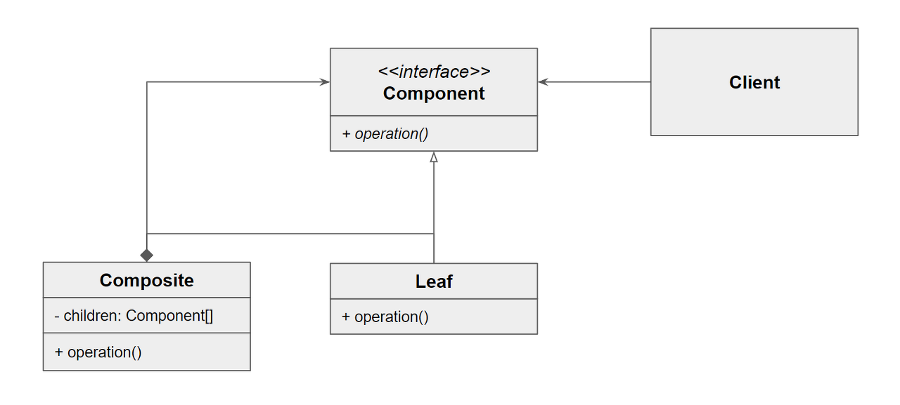

# 컴포지트 패턴이란?
컴포지트 패턴은 클라이언트가 복합 객체나 단일 객체를 ```동일하게``` 취급하는 것을 목적으로 한다.

트리 형태로 데이터를 표현할 수 있을 때 유용하며, 여러 오브젝트를 트리 구조로 재구성한 뒤 오브젝트들을 각각의 오브젝트처럼 이용한다.



- Component 가 구조상 가장 Primitive 한 단위가 된다.
- Component 를 구현한 것이 Leaf 가 된다.
- Component 를 구현하면서 내부에 Component 를 포함하는 것이 Composite 가 된다.
- Client 입장에서는 전체나 혹은 부분 모두 동일하게 Component 로 인식할 수 있게 된다.
  - Composite 도 Component 를 구현한 구현체이기 때문이다.
  - Client 는 둘을 구분하지 않고 둘 다 Component 라는 인터페이스를 구현했다는 사실만 본다.
# 장점
- 유연성
  - 객체의 구조를 변경하는데 유용하다
  - 새로운 개별 객체나 복합 객체를 추가하더라도 클라이언트가 코드를 수정할 필요가 없다.
  - 객체 간 결합도를 낮춰준다.
- 단순성
  - 개별 객체와 복합 객체를 동일한 방식으로 다룰 수 있다.
  - 이로 인해 클라이언트의 코드가 단순해진다.
- 재사용성
  - 객체를 구성하는 방식이 일관성 있고, 재사용성이 높은 구조를 만들 수 있다.
- 구조적 안정성
  - 복합 객체 내부의 구조를 안정적으로 유지할 수 있다.
  - 복합 객체에서 개별 객체를 제거하더라도, 객체 간 관계가 깨지지 않는다.
# 단점
- 처리 비용
  - 복합 객체 내부의 모든 개별 객체를 처리해야 한다.
- 설계 복잡성
  - 객체의 구조가 복잡한 경우에는 효과적이지만, 객체의 구조가 단순할 경우 오히려 설계의 복잡성을 증가시킨다.
- 한계
  - 개별 객체와 복합 객체가 서로 다른 인터페이스를 가지는 경우나, 복합 객체 내부 구조가 동적으로 변하는 경우 컴포지트 패턴을 적용하기 힘들다.
# Ref
- https://jake-seo-dev.tistory.com/399
- https://jangjjolkit.tistory.com/60
