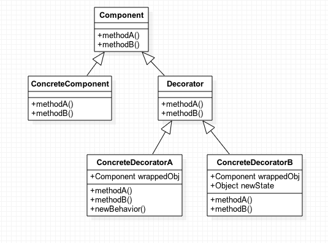

# 데코레이터 패턴이란?
대상 객체에 대한 기능 확장이나 변경이 필요할 때 객체의 결합을 통해 서브 클래스 대신 사용할 수 있는 유연한 대안 구조 패턴.

이 패턴을 통해 필요한 추가 기능의 조합을 런타임에서 동적으로 생성할 수 있다.

데코레이팅할 대상 객체를 새로운 행동들을 포함한 특수 장식자 객체에 넣어 행동들을 장식자 객체마다 연결시켜,
서브 클래스로 구성할 때 보다 유연하게 기능을 확장할 수 있다.

# 장점
- 기능 확장을 위해 서브클래싱에 대한 유연한 대안 제공
- 런타임에 동작 수정 허용
- OCP
# 단점
- 디자인에 많은 객체를 생성할 수 있고 남용 시 복잡할 수 있다
- 클라이언트가 구성 요소의 구체적인 유형에 크게 의존하는 경우 데코레이터가 문제를 일으킬 수 있음
- 데코레이터는 구성요소를 인스턴스화해야 할 뿐 아니라 여러 데코레이터로 래핑해야 하기 때문에 구성요소를 인스턴스화하는 프로세스를 복잡하게 만들 수 있음