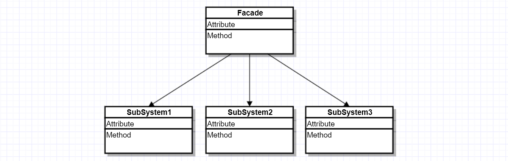

# 퍼사드 패턴이란?
사용하기 복잡한 클래스 라이브러리에 대해 사용하기 편하게 간편한 인터페이스를 구성하기 위한 구조 패턴이다.

예시로 라이브러리의 각 클래스와 메서드들이 어떤 목적의 동작인지 이해하기 어렵다면, 이에 대한 적절한 네이밍과 정리를 통해 사용자로 하여금 쉽게 다룰 수 있도록 인터페이스를 만들 수 있다.

이처럼 퍼사드 패턴은 복잡하게 얽혀 있는 것을 정리해 사용하기 편한 인터페이스를 클라이언트에게 제공한다.

클라이언트는 복잡한 시스템을 알 필요 없이 시스템의 외부에 대해 단순한 인터페이스를 이용하기만 하면 된다.

# 장점
- 하위 시스템의 복잡성에서 코드를 분리하여, 외부에서 시스템을 사용하기 쉬워진다.
- 하위 시스템 간의 의존 관계가 많을 경우, 이를 감소시키고 의존성을 한 곳으로 모을 수 있다.
- 복잡한 코드를 감춤으로써, 클라이언트가 시스템의 코드를 모르더라도 Facade 클래스만 이해하고 사용할 수 있다.
# 단점
- 퍼사드가 앱의 모든 클래스에 결합된 객체가 될 수 있다.
- 퍼사드 클래스 자체가 서브시스템에 대한 의존성을 가지게 되어 의존성 문제를 완전히 피할 수 없다.
- 추가적인 코드로 유지보수 비용이 늘어난다.
# Ref
- https://inpa.tistory.com/entry/GOF-%F0%9F%92%A0-%ED%8D%BC%EC%82%AC%EB%93%9CFacade-%ED%8C%A8%ED%84%B4-%EC%A0%9C%EB%8C%80%EB%A1%9C-%EB%B0%B0%EC%9B%8C%EB%B3%B4%EC%9E%90