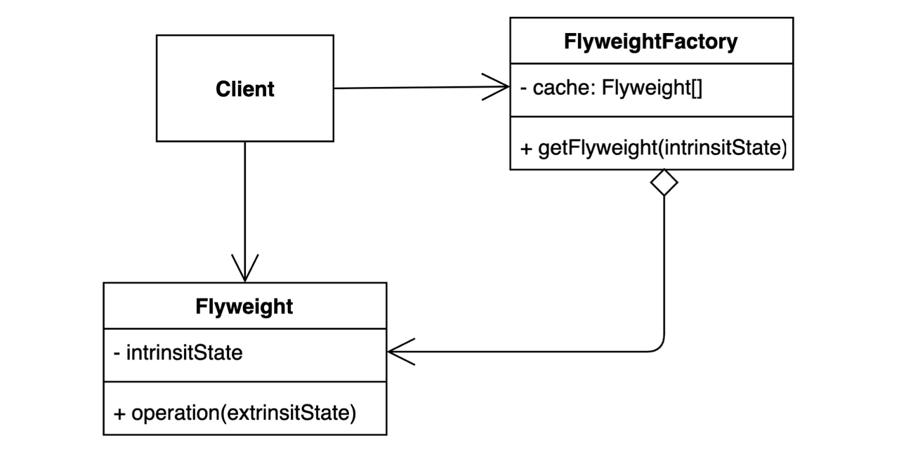

# 플라이 웨이트 패턴이란?
공통으로 사용하는 클래스를 생성하는 팩토리 클래스를 만들어, 인스턴스를 최초 1개만 생성하고 공유하여 재사용할 수 있도록 하는 구조 패턴이다.

자주 변하는 속성과 변하지 않는 속성을 분리하고 재사용하여 메모리 사용을 줄인다.

# 활용처
- 공통적인 인스턴스를 많이 생성하는 로직이 포함된 경우
- 자주 변하지 않는 속성을 재사용할 수 있는 경우

# 장점
- 공유 객체에 의해 메모리에 로드되는 객체의 개수를 줄일 수 있다.
# 단점
- 특정 인스턴스의 공유 컴포넌트를 다르게 행동하게 하는 것이 불가능하다.
# 예시
- StringPool
- valueOf()