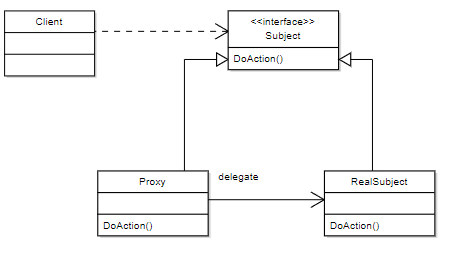

# 프록시 패턴이란?
프록시는 대리인이라는 뜻으로, 무엇인가를 대신 처리한다는 의미이다.

어떤 객체를 사용하고자 할 때, 객체를 직접 참조하는 것이 아니라 해당 객체를 대행하는 객체를 통해 

대상 객체에 접근하는 방식을 사용하면 해당 객체가 메모리에 존재하지 않아도 

기본적인 정보를 참조하거나 설정할 수 있고, 실제 객체의 기능이 반드시 필요한 시점까지 객체의 생성을 미룰 수 있다.

# 장점
- 기존 코드를 변경하지 않고 새로운 기능을 추가할 수 있다.
  - OCP
- 대상 객체는 자신의 기능에만 집중하고, 그 외 부가 기능을 제공하는 역할을 프록시 객체에 위암하여 다중 책임을 회피 할 수 있다.
  - SRP
- 유연한 코드를 만들 수 있다.
  - 초기화 지연 및 부가 기능 추가(로깅, 시간 측정, 캐싱), 흐름 제어 등
# 단점
- 코드의 복잡도가 증가한다.
- 빈번한 객체 생성이 필요한 경우 성능이 저하될 수 있다.
  - 객체 생성을 위해 스레드 생성 및 동기화 구현이 요구될 경우
